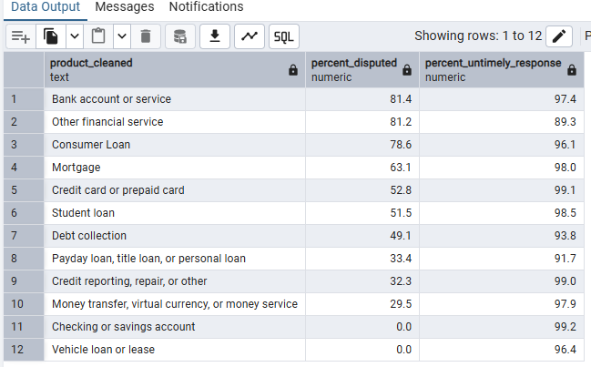

# consumer_complaints_analysis
SQL_Prj_of_consumer_complaints

**Executive Summary**  
This report analyzes 1.28 million consumer complaints filed between 2011 and 2019, involving 5,257 companies and 167 issue types.  
- 97.5% of complaints received a timely response, showing strong responsiveness across industries.  
- 2.5% of complaints — over 32,000 cases — were responded to late.  
- 11.6% of complaints (around 148,000) were disputed by consumers, indicating ongoing dissatisfaction.  
- The Mortgage category received the most complaints, making it the most problematic sector for consumers.  

**Deep Insights**

**Q1: identify which product categories receive the highest number of consumer complaints.**  
*Most Complainted:* Credit reporting, repair, or other received the highest number of complaints **366K** — indicating major consumer dissatisfaction in credit data management and accuracy.  
*Least Complained:* Other financial service had the lowest complaints **1K**.

**Q2: What Are the Yearly Trends of Complaints?**  
Complaints increased significantly *from 2011 through 2018*, indicating growing consumer awareness or dissatisfaction.  
2011 had the *fewest* complaints, possibly due to limited awareness or underreporting.  
A drop in 2019 may reflect incomplete data or changes in reporting systems.

**Q3: Which Products Are Most Disputed and Poorly Handled?**  
While some categories consistently manage disputes and timely responses well, others — particularly in lending and banking — face serious service gaps.

*Best-Handled Categories (Consumer did not dispute & company gave a timely response):*  
Categories like **Bank Accounts, Consumer Loans, and Other Financial Services** are doing well in avoiding customer disputes and responding quickly.  
However, **Credit Reporting and Payday Loans** suffer from high dissatisfaction, even when response times are acceptable.  
This shows that fast replies don’t necessarily mean good service — the quality of resolution and clarity in communication likely need improvement in those categories.

*Worst-Handled Categories (Consumer disputed & company gave a late response):*  
- Categories such as **Consumer Loans, Bank Accounts, Mortgage Services** show the highest rates of consumer disputes and poor timely responses.  
- These patterns suggest unresolved issues, slow support processes, and a need for better customer service strategies in these segments.  
- **Other Financial Services and Payday, Title, Personal Loans** also show relatively poor handling, these segments may be overlooked but still contribute to negative consumer experiences.  
- **Credit Reporting, Credit Cards, and Student Loans** show lower dispute rates and faster, more timely responses. 

**Meet Rate Insight (Complaint Quality Score)**  
*Meet Rate* is a custom metric that shows how many complaints were handled smoothly — meaning the *customer didn’t dispute*, the *company responded on time*, and the *response wasn’t flagged as late or inadequate.*

**Key Findings:**  
*Highest Meet Rate:* categories like Bank Accounts, Consumer Loans, and Other Financial Services demonstrate the highest quality of complaint resolution.  
*Lowest Meet Rate:* areas like Credit Reporting, Debt Collection, and Payday Loans show serious challenges, with low meet rates and higher customer dissatisfaction.  
This highlights where service teams and regulatory focus should be directed to improve fairness and responsiveness in complaint handling.  

**Recommendations**  
Focused efforts on improving dispute resolution speed and proactive support can help rebuild trust in high-risk categories.  
Prioritize service improvements in Consumer Loans, Mortgages, and Bank Accounts, which consistently show high dispute rates and low satisfaction. Focus on better case resolution, simplified processes, and customer support training.  
Credit Reporting shows the highest complaint volume and ongoing dispute issues despite fast response times. Improve data accuracy, error correction processes, and transparency in reporting to rebuild consumer trust.

**Visualization with Power BI**

